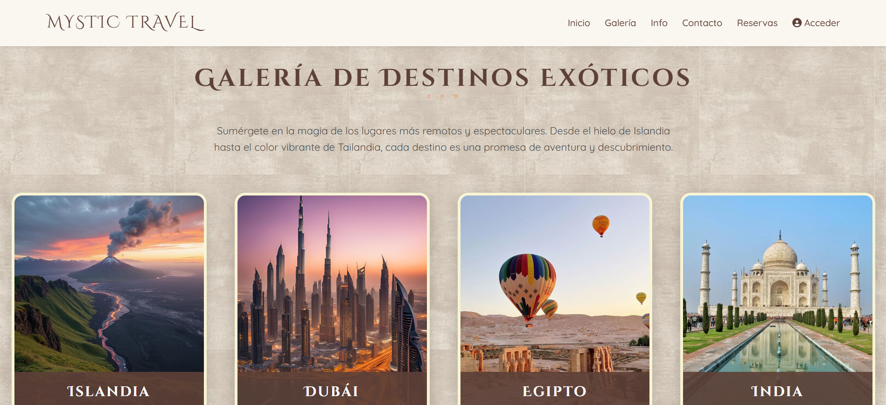

# 🌍 Mystic Travel – Agencia de Viajes y Plataforma Web FullStack

Aplicación web completa desarrollada con **Django + PostgreSQL**, que permite a los usuarios explorar destinos exóticos, enviar solicitudes de viaje, realizar reservas y contactar a la agencia.  
Incluye un **panel administrativo**, sistema de autenticación avanzada, **CMS personalizado**, galería dinámica y consumo de **APIs externas**.

---

## Proyecto desplegado
🔗 **https://proyectomystictravel.onrender.com**

---

## Funcionalidades principales

### Sistema de autenticación avanzado
- Registro con validación por email  
- Inicio/Cierre de sesión  
- Recuperación de contraseña  
- Permisos diferenciados (usuarios / staff)

---

### Panel de administración (solo staff)
- Dashboard general  
- Gestión de consultas (CRUD)  
- Gestión de reservas (CRUD)  
- Acceso a API REST (JSON)  
- Clasificación automática de mensajes  
- Editor CMS para modificar el contenido del Home

---

### Sección pública
#### **Landing Page**
- Hero dinámico (editable desde CMS)  
- Filosofía de viaje  
- Iconografía  
- Formulario de contacto con clasificación automática  

#### **Galería de destinos**
- Vista general de destinos  
- Subgalería con imágenes por destino  
- Descripciones dinámicas  a lo

#### **Reservas**
- Formulario con validaciones  
- Envío de emails al usuario y al administrador  
- Confirmación visual post–envío

#### **Información**
- Consumo de APIs externas:  
  - Tasas de cambio  
  - Información del país (capital, población, idiomas, moneda)

---

## API REST (Django REST Framework)

- **/api/reservas/** → Listado JSON de reservas  
- **/api/consultas/** → Listado JSON de consultas  

Permite lectura desde clientes externos.  

---

## Tecnologías utilizadas

### **Backend**
- Python  
- Django  
- Django REST Framework  
- PostgreSQL  
- Render (deploy)  

### **Frontend**
- HTML5  
- CSS3  
- JavaScript (vanilla)  
- Bootstrap 5  
- Plantillas Django  
- Iconos & Google Fonts  

---

## Capturas de pantalla  

### Home

### Galería de Destinos

### Vista de Subgalería

### Formulario de Contacto

### Formulario de Reserva

### Panel Administrativo

---

---

## 👤 Autora
**Candela Godoy**  
Desarrolladora Backend / FullStack Jr.